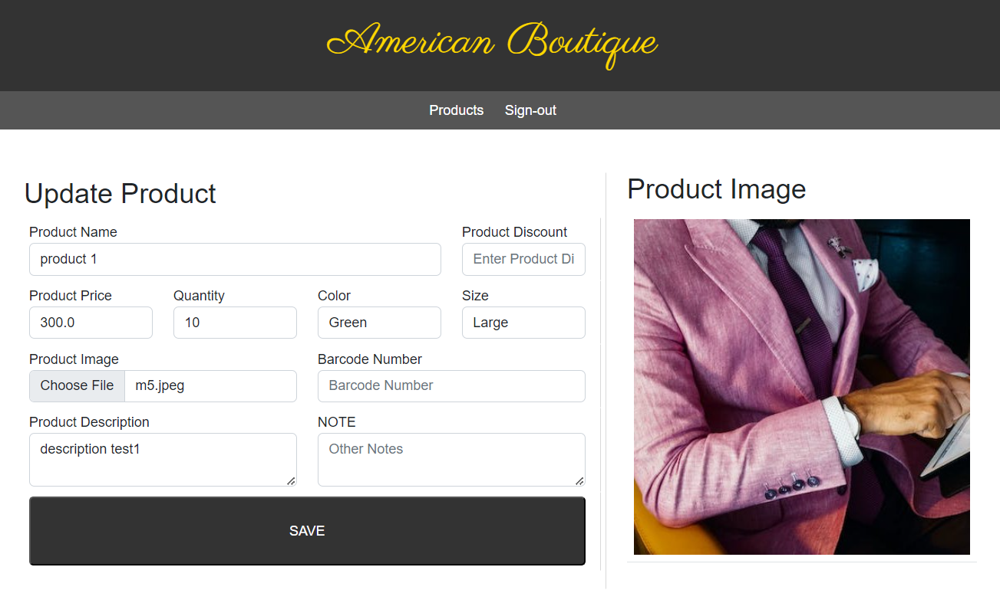
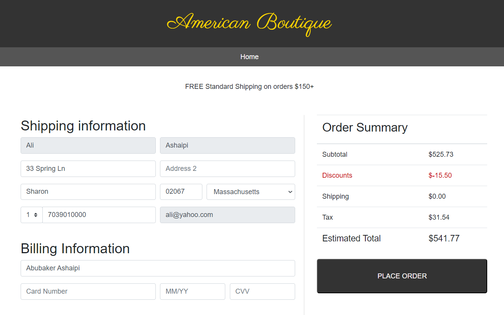
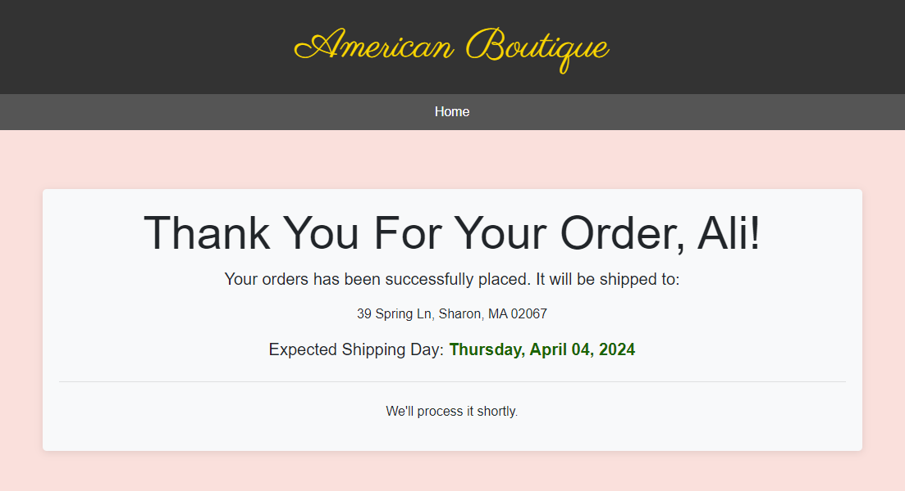

# American Boutique Application

## Description
The American Boutique application is an e-commerce platform designed to facilitate the buying and selling of products online. It provides users with a user-friendly interface to browse products, add them to their shopping bag, and place orders securely.

## Features
User and Manager Authentication: Users and Managers can sign up, sign in, and sign out securely.

Product management: Managers can add update delete products.

Product Catalog: Users can browse through a catalog of available products.

Shopping Bag: Users can add products to their shopping cart and manage their cart.

Order Placement: Users can place orders securely.

## Technologies Used
- Java (JDK 21): Backend programming language.
- Spring Boot (3.0.4): Framework for building Java applications.
- Thymeleaf (3.1.2): Java template engine for server-side rendering of HTML.
- Hibernate (6.0.1): Object-relational mapping (ORM) framework for data persistence.
- MySQL (8.0.30): Relational database management system.
- HTML/CSS: Frontend technologies for building user interfaces.
- Bootstrap (3.3.7): Frontend framework for building responsive and mobile-first websites.

## Installation
Clone the repository to your local machine: git clone <https://github.com/ashaipi/AmericanBoutiqueV5>
Set up the MySQL database and configure the database connection in the application.properties file.
Run the application using Maven: mvn spring-boot:run
Access the application in your web browser at http://localhost:8080.

## Usage
Register a new account or log in with existing credentials.
Browse through the product catalog and add products to your shopping cart.
View and manage your shopping cart contents.
Proceed to checkout to place an order.
View your order history and manage your profile settings.

### Authorship: Developed by Abubaker Ashaipi - March 2024