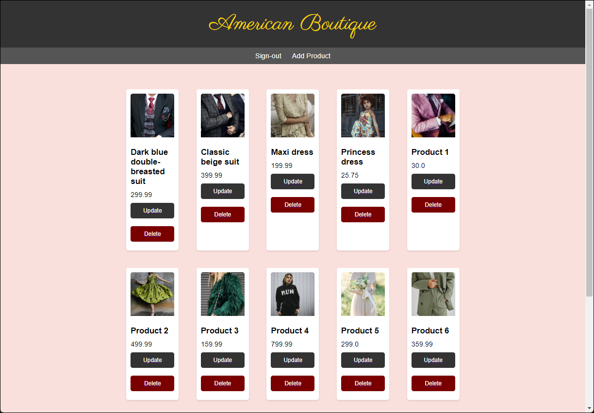

# American Boutique Application

## Description
The American Boutique application is an e-commerce platform designed to facilitate the buying and selling of products online. It provides users with a user-friendly interface to browse products, add them to their shopping bag, and place orders securely.

## Features
User and Manager Authentication: Users and Managers can sign up, sign in, and sign out securely.

Product management: Managers can add, edit, and delete products.

The "**Create New Product**" Feature.
Seamlessly add new items to and save them to a database,
with entering details such as Product Name, Discount (it will calculate in Shopping Bag and Placing Order),
Price, Quantity, Color, Size, along with uploading Product Images and assigning Barcode Numbers.
Craft compelling descriptions and add special notes

The "**Update Product**" feature.
Easily modify details like Product Name, Discount, Price, Quantity, Color,
Size, and even upload new Product Images or update Barcode Numbers,
rewrite Product Descriptions and update notes

The "**Home Page**" Product Catalog: Users can browse through a catalog of available products.
Curated selection of products showcasing their names,
 images, and prices, with an "Add to Bag" button.
Keep track of your selections with a dynamic shopping bag icon displaying the total number of items added.
And Account icon to Sign-in or change user.

**Shopping Bag**: Users can add products to their shopping bag as well as manage their selected items.
Also visualize items with product images alongside their names, descriptions, sizes, and colors.
With discounts showcased prominently,
with both the original price struck through, and the new discounted price highlighted.

Review the Order Summary for a comprehensive overview of the purchase.
Delve into details such as Subtotal, Discounts, Shipping charges, and Tax.
Get a clear picture of your Estimated Total

Order Placement: Users can place orders securely.
Checkout process by providing Shipping Information, including your First and Last Name,
Address (both primary and secondary if applicable), City,
Zip Code, State, Country, Contact Phone Number, and Email Address.
Billing Information, such as the Cardholder's Name, Card Number, Expiration Date (MM/YY), and CVV

Finally, a moment to express our gratitude.
Thank you for your order,[User name]
Your purchase has been successfully placed and is on its way to you.
It will be shipped to the address provided: [address].
Anticipate its arrival by [Expected date].
We're diligently processing your order and ensuring a seamless delivery experience.

## Database tables

## Technologies Used
- Java (JDK 21): Backend programming language.
- Spring Boot (3.0.4): Framework for building Java applications.
- Thymeleaf (3.1.2): Java template engine for server-side rendering of HTML.
- Hibernate (6.0.1): Object-relational mapping (ORM) framework for data persistence.
- MySQL (8.0.30): Relational database management system.
- HTML/CSS: Frontend technologies for building user interfaces.
- Bootstrap (3.3.7): Frontend framework for building responsive and mobile-first websites.
 
## Installation
Clone the repository to your local machine: git clone <https://github.com/ashaipi/AmericanBoutiqueV5>
Set up the MySQL database and configure the database connection in the application.properties file.
Run the application using Maven: mvn spring-boot:run
Access the application in your web browser at http://localhost:8080.

## Usage
Register a new account or log in with existing credentials.
Browse through the product catalog and add products to your shopping cart.
View and manage your shopping cart contents.
Proceed to checkout to place an order.
View your order history and manage your profile settings.

### Authorship: Developed by Abubaker Ashaipi - March 2024